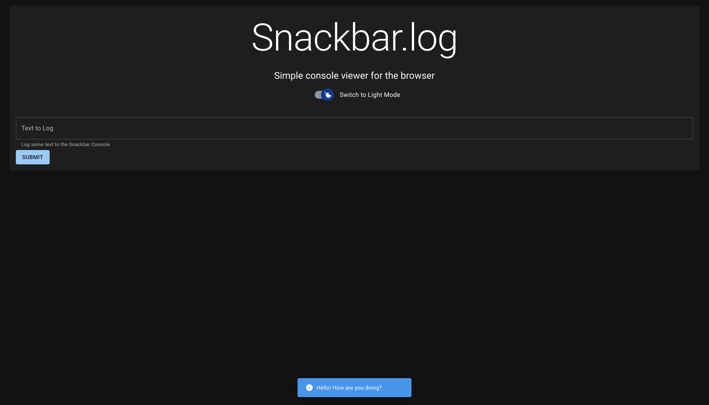

# Snackbar.log

A simple, elegant console viewer for the browser.

## Screenshots



More screenshots can be found in the resources folder.

## Features

- Light/dark mode toggle
- Mobile-friendly

## Installation

Clone or fork the project!

```bash
git clone
```

```bash
git fork
```

At the root of the project, open a terminal and install the relevant packages:

```bash
npm install
```

Then run the project in your browser of choice:

```bash
npm start
```

## Contributing

Contributions are always welcome!

See `contributing.md` for ways to get started.

## Lessons Learned

This project is mainly to practice [Material UI](https://github.com/mui/material-ui), especially the [Snackbar API](https://mui.com/material-ui/react-snackbar/#main-content).

## Roadmap

- Write tests with [AVA](https://github.com/avajs/ava)
- Incorporate CI/CD with [husky](https://github.com/typicode/husky)
- Customize pallettes/themes
- Incorporate Tailwind CSS, potentially using [Material Tailwind](https://github.com/creativetimofficial/material-tailwind) or MUI's [Tailwind interop guide](https://mui.com/material-ui/guides/interoperability/#tailwind-css)

## License

[MIT](https://choosealicense.com/licenses/mit/)

## Create-react-app README

This project was made using create-react-app. The original [README](CRA-README.md) is included for reference.
